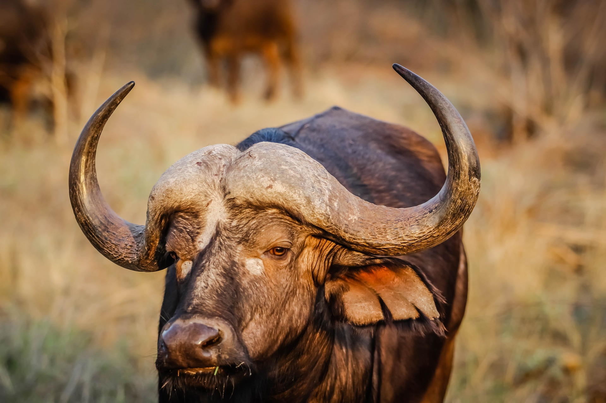

# Caption1

This is Caption 1.

## Caption2

This is Caption 2.

### Caption3

This is Caption 3.

#### Caption4

This is Caption 4.

##### Caption5

This is Caption 5.

###### Caption6

This is Caption 6.

## Paragraph

This is first line of first Paragraph.  
This is second line of first Paragraph.

This is the first line of the second Paragraph.  
This is the second line of the second Paragraph.

## Unordered List

This is Unordered List.

- 1
- 2
    - 2-1
    - 2-2
        - 2-2-1
        - 2-2-2
- 3

This is Unordered List.

## Ordered list

This is Ordered list.

1. 1
1. 2
    1. 2-1
    1. 2-2
        1. 2-2-1
        1. 2-2-2
1. 3

This is Ordered list.

## Quote

This is a Quote.

> Quote
> Quote

This is a Quote.

## Code block

This is Code block.

```ruby
puts 1 + 1
```

This is Code block.

## Table

This is Table.

| Left align | Right align | Center align |
|:-----------|------------:|:------------:|
| This       |        This |     This     |
| column     |      column |    column    |
| will       |        will |     will     |
| be         |          be |      be      |
| left       |       right |    center    |
| aligned    |     aligned |   aligned    |

This is Table.

## Link

This is Link. [Link](http://example.com)

## Code

This is Code. `puts 1 + 1`

## Strong emphasis

This is **Strong emphasis** .

## Emphasis

This is *Emphasis* .

## Deleted text

This is ~~Deleted text~~ .

### Definition list

This is Definition list.

<dl>
  <dt>Penguin</dt>
  <dd>flightless birds</dd>
  <dt>Goose</dt>
  <dd>waterfowl of the family Anatidae</dd>
</dl>

This is Definition list.

## Horizontal line

This is Horizontal line.

---

This is Horizontal line.

## Image

This is Image. 
